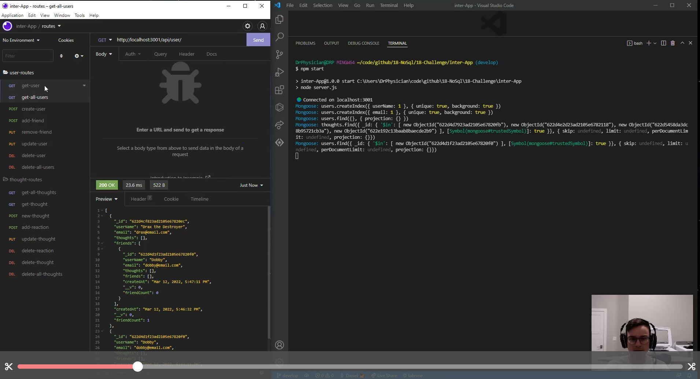

# inter-App

Interactive social networking API designed for any frontend platform. Ready, set, inter-App!

## Description

### Walk-through Video

This application is not deployed, but is a social-networking API designed to be integrated with any application desiring this functionality.

inter-App lends itself to any application looking to incorporate users, comments, and friends into their app. This is a simple-to-use design with a lot of power behind the curtain.

inter-App is built on a MongoDB database and operates on the Mongoose ODM to give the data structure and reliability. Express is responsible for all of the routing and will integrate seamlessly with your front end.

The app incorporates users, comments (Thoughts), reactions, and friends. Thoughts are dependent on Users, so removing a user removes all of their thoughts. Friends are simply relations of users to one another, and reactions are actually stored in Thoughts, so deleting a thought will delete all of its reactions by default.

## Table of contents

- [Installation](#installation)
- [Usage](#usage)
- [Maintainers](#maintainers)
- [Contributing](#contributing)
- [Tests](#tests)
- [Credits](#credits)
- [License](#license)

## Installation

It is important that you have both node.js and MongoDB installed before attempting to install the rest of the application's dependencies and running it.

Then begin by running `npm install` in your terminal and finally `npm start`. You can import the included `Insomnia-routes-interApp.json` file into Insomnia if you are using that to test the routes. That file includes every possible route currently included with inter-App.

## Usage

Once the app is running, it is just a matter of testing each route. Keep in mind that there will only ever be one id required in the url of the route. Any other required ids will be required in the body of the request.

There are useful error messages with each route that will tell you what to do next if the route is not working.

## Maintainer

[@Daniel Harned](https://github.com/DrDano)

Email: [danielharned@gmail.com](mailto:danielharned@gmail.com)

## Contributing

Fork the project if you would like to contribute, and build into any front end!

## Credits

- [MongoDB](https://www.mongodb.com/cloud/atlas/lp/try-atlas?utm_source=google&utm_campaign=gs_americas_united_states_search_core_brand_atlas_desktop&utm_term=mongodb&utm_medium=cpc_paid_search&utm_ad=e&utm_ad_campaign_id=12212624338&adgroup=115749704103&gclid=Cj0KCQiAybaRBhDtARIsAIEG3knu0DQ4zdAabvtsECRWGjITeu7aHhciTI-yJDJsNeZIADo0oS6HmdAaAm-hEALw_wcB)
- [Mongoose](https://mongoosejs.com/)
- [express.js](https://expressjs.com/)

## License

Licensed under [MIT](https://choosealicense.com/licenses/mit) 2022

